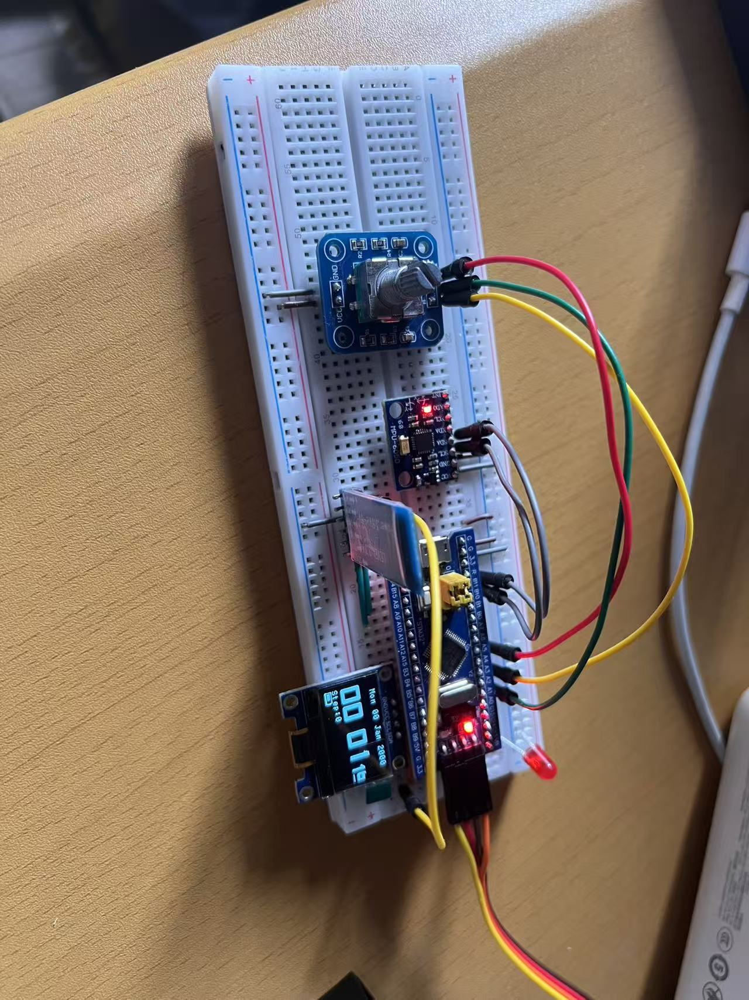

# ⌚ 嵌入式系统课程设计：基于 STM32 与 FreeRTOS 的智能手表设计

**团队名称**：呃啊~
**主控芯片**：STM32F103C8T6  
**操作系统**：FreeRTOS  

## 📑 项目简介

本项目是一款基于 STM32 微控制器与 FreeRTOS 实时操作系统的智能手表。系统摒弃了传统的裸机前后台轮询架构，通过引入 RTOS 实现了多任务的高效调度，完成了 UI 渲染、高频传感器采集、无感人机交互与异步蓝牙通信的系统级解耦。

本项目不仅完成了基础的时间与数据展示功能，更在底层总线时序、外设交互状态机及硬件协处理方面进行了深度优化。

## 🚀 项目设计创新点 (核心技术贡献)

1. **RTOS 抢占式多任务架构设计** 系统被划分为显示、按键、传感器、蜂鸣器等 5 个独立 Task。利用互斥锁（Mutex）保护 OLED 全局显存防止画面撕裂，同时将蜂鸣器与交互任务设为高优先级，确保了用户操作的绝对零延迟响应，极大提升了 CPU 资源利用率。

2. **IIC 总线突发传输与渲染提速** 针对传统软件 IIC 刷新 OLED 存在“刷漆感”的痛点，深入重构底层时序逻辑。摒弃低效的单字节握手，实现 128 字节连续数据块传输（Burst Transfer），使屏幕刷新帧率呈倍数提升，实现丝滑流畅的 UI 动画。

3. **EC11 旋转编码器极速状态机重构** 在交互层面上，彻底推翻传统的 40ms 机械按键防抖机制。针对 EC11 快速旋转时高频的 A/B 相脉冲，设计了直接捕捉边沿跳变并校验电平的极速状态机（结合硬件定时器模式），彻底消灭了多任务调度下的“漏步”现象，实现了丝滑的多级菜单滚动。

4. **“硬件卸载”理念：DMP 协处理与 DSO 示波器** 为降低主控浮点运算负荷并优化功耗，摒弃软件波峰波谷解算，直接使能 MPU6050 内置的 DMP（数字运动处理器）进行卡尔曼滤波与硬件计步。并在 UI 层面创新性地开发了微型数字示波器（DSO），实现了姿态数据（Roll/Pitch）的动态波形实时绘制。

5. **时空同步与万年历基姆拉尔森推演** 建立轻量级蓝牙通信指令集，实现与手机端的数据透传。在底层处理 C 库日历方言差异，并内嵌“基姆拉尔森计算公式”，赋予单片机在接收任意日期时自动反推星期的推演能力。

## 📸 实物演示与照片

### 整体硬件组装实物图

## 🛠️ 硬件物料清单

* **核心板**：STM32F103C8T6 最小系统板
* **显示模块**：0.96寸 OLED 屏幕 (IIC 接口)
* **姿态传感器**：MPU6050 (六轴加速度计+陀螺仪)
* **交互模块**：EC11 旋转编码器带按键
* **通信模块**：蓝牙串口模块HC-05
