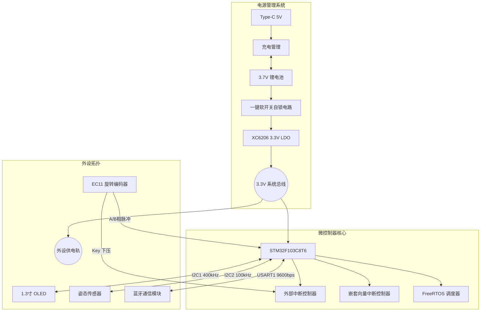
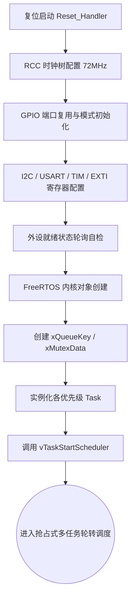

# 2026嵌入式系统课程设计 - 智能手表系统设计文档

## 一、 物料到位情况与实物核对

本小组针对智能手表项目进行了全面的硬件评估与物料采购。为实现高频次的软硬件联合调试与敏捷迭代，团队决议采用**高集成度面包板原型搭建**方案，以规避 PCB 打样周期带来的时间风险。

### 1. 已到货物料与关键参数核对
当前项目核心元器件已 100% 到货，经实测电气特性正常，完全满足底层开发需求：

* **核心控制单元**：STM32F103C8T6 最小系统板 $\times 1$。搭载 ARM Cortex-M3 内核，提供 72MHz 算力与充足的中断资源，为 FreeRTOS 提供强力支撑。
* **人机交互显示**：1.3寸 OLED 显示模块 $\times 1$。采用 SH1106 驱动，I2C 接口（地址 0x78），用于渲染多层级 UI。
* **姿态感知单元**：MPU6050 六轴运动传感器 $\times 1$。内置 16-bit ADC 与 DMP 硬件解算引擎，I2C 接口，为计步算法提供高精度三轴加速度数据。
* **物理输入外设**：EC11 旋转编码器 $\times 1$。带下压按键，输出正交脉冲信号，实现防误触的高效菜单导航。
* **无线通信链路**：JDY-31 蓝牙透传模块 $\times 1$。USART 接口，支持标准 AT 指令与波特率自适应，负责手机端数据同步。
* **能源管理系统**：TP4056 Type-C 锂电池充电模块 $\times 1$；XC6206P332MR (3.3V LDO) 稳压管 $\times 1$；3.7V 500mAh 聚合物锂电池 $\times 1$。
* **原型基板与线材**：高品质面包板 $\times 2$（级联），低阻抗单股纯铜导线 $\times$ 若干。

### 2. 未到货物料及进度风险
* **未到货物料**：无。
* **风险控制**：所有物料均备有冗余件，面包板物理走线已完成基础固化，不存在因物流延期导致的进度停滞风险。

---

## 二、 系统方案设计

### 1. 系统总体架构设计
系统采用“传感器感知 $\rightarrow$ RTOS 调度 $\rightarrow$ 逻辑解算 $\rightarrow$ 结果反馈”的闭环架构。
底层硬件依托 STM32 丰富的外设总线（I2C, USART, TIM）进行分布式挂载；中间件层全量移植 FreeRTOS V10+ 内核，接管 SysTick 滴答定时器；应用层基于优先级队列构建松耦合的多任务并发模型。

### 2. 软件运行流程图
系统冷启动后，严格遵循“硬件级 $\rightarrow$ 驱动级 $\rightarrow$ OS 级”的初始化序列，确保临界资源在多任务启动前分配完毕。

---

## 三、 详细设计文档

### 1. 硬件部分详细设计与电路规范

#### 1.1 关键元件参数计算与选型逻辑
* **电源去耦网络**：为抑制 MPU6050 和 OLED 动态功耗引起的电压跌落，LDO 输出端采用旁路滤波设计。紧贴 MCU 的 VDD 引脚并联 $10\mu\text{F}$ 钽电容（抑制低频纹波）与 $0.1\mu\text{F}$ MLCC 陶瓷电容（吸收高频开关噪声）。
* **I2C 阻抗匹配**：面包板寄生电容（预估 $\approx 30\text{-}50\text{pF}$）会劣化开漏输出的上升沿时序。为保证 I2C1 (OLED) 在快速模式下时序合规，其 SCL/SDA 总线强制外挂 $4.7\text{k}\Omega$ 上拉电阻。
* **编码器硬件滤波**：EC11 的 A/B/Key 信号脚对地并联 $10\text{nF} (103)$ 瓷片电容，配合内部上拉电阻，在硬件层面上滤除极高频的机械弹跳尖峰。

#### 1.2 端口复用与面包板布线规划
为防止数字高频信号串入模拟/传感前端，引脚分配与物理走线采用正交隔离策略：
* **I2C 物理隔离**：OLED 挂载 I2C1 (PB6/PB7)，MPU6050 挂载 I2C2 (PB10/PB11)。两者在面包板上分别位于 MCU 的对侧，杜绝空间串扰。
* **星型接地 (Star Grounding)**：所有外设的 GND 必须独立回流至面包板的总接地轨，严禁外设之间“菊花链”式串联接地，以降低共阻抗耦合干扰。
* **定时器硬解码**：EC11 接入 PA0 (TIM2_CH1) 与 PA1 (TIM2_CH2)。利用 STM32 定时器的 Encoder Mode 进行硬件正交解码，不占用任何 CPU 中断资源即可实现精准计步。

### 2. 软件部分详细设计

#### 2.1 模块划分与外设配置方案
* **底座驱动层 (BSP)**：重写软件模拟 I2C 驱动（引入纳秒级 `__NOP()` 精确延时），规避硬件 I2C 锁死隐患；配置 USART1 为异步全双工，开启 RXNE 接收中断。
* **中间件层 (OS)**：采用 `heap_4.c` 内存分配方案，有效合并相邻空闲内存块，防止长时间运行后出现内存碎片导致死机。

#### 2.2 FreeRTOS 任务调度与资源分配设计
基于系统硬实时性要求，划分四大常驻任务，并采用抢占式调度机制：

| 任务名称 (Handle) | 优先级 | 堆栈深度 | 核心职能与调度机制描述 |
| :--- | :---: | :---: | :--- |
| `vTaskInteract` | 4 (最高) | 128 Word | **中断延迟处理任务**。平日处于阻塞态，一旦 EC11 按键触发 EXTI 中断，ISR 释放二值信号量唤醒此任务，处理菜单逻辑并推入队列。 |
| `vTaskSensor` | 3 (高) | 256 Word | **强实时采集任务**。利用 `vTaskDelayUntil()` 实现绝对精度的 50Hz (20ms) 周期执行，读取 MPU6050 并驱动计步算法。 |
| `vTaskUI` | 2 (中) | 256 Word | **显示渲染任务**。监控按键消息队列，有动作时重绘当前状态机对应的屏幕区域；无交互时仅以 1Hz 频率局部刷新主时间表盘。 |
| `vTaskBle` | 1 (低) | 128 Word | **异步通信任务**。通过查询环形缓冲区（Ring Buffer）处理上位机下发的时间校准指令，并打包发送当天的步数统计。 |

#### 2.3 关键算法描述：动态自适应阈值计步算法
传统的静态阈值无法适配不同用户的步伐强度。本项目在 `vTaskSensor` 中设计了具有时域特征分析的动态计步引擎：

1. **模长提取**：获取三轴原始数据，计算绝对加速度幅值 $A_k = \sqrt{x^2 + y^2 + z^2}$。
2. **数字滤波**：构建深度为 $N=8$ 的一维环形缓冲区（Ring Buffer），执行滑动平均滤波，滤去极高频的机械震动毛刺。
3. **动态阈值自适应**：系统实时维持一个 1 秒的时间窗口，在此窗口内寻找加速度的局部极大值 $Max$ 和极小值 $Min$。
   - 动态阈值门限：$Threshold = \frac{Max + Min}{2}$
   - 噪声死区门限：$\Delta = Max - Min$。若 $\Delta < \text{噪声基线}$，则判定当前处于静止状态，停止计步运算。
4. **状态机波峰判定**：当滤波后的数值**上穿** $Threshold$，且距离上一次有效计步的时间间隔 $\Delta T$ 落在合理的步伐频域内（如 $250\text{ms} < \Delta T < 1500\text{ms}$），则判定为有效步伐，系统步数累加并触发 UI 刷新。

---

## 四、 进度汇报与中期检查前规划

### 1. 当前完成情况 (截至 7月2日)
初步完成OLED显示模块phase1，着手开始phase2，事先对陀螺仪进行了调试，通过串口初步完成位移检测以及步数计量，待后续开发好显示屏UI界面后并入即可。

### 2. 后续工作瓶颈与应对计划
* **近期计划 (至7月6日中期检查前)**：
  * **瓶颈优化**：当前计步算法在快速甩手时有一定误判率。计划引入方差分析，增强对无规律扰动的过滤能力。
  * **功能补全**：往后编写蓝牙模块代码以及尽可能丰富菜单功能。
* **远期计划 (验收阶段)**：
  * 进行系统的深度功耗评估。利用 FreeRTOS 的 Idle Task 钩子函数（Hook），在 CPU 空闲时将其切入 Sleep 模式，延长 500mAh 锂电池的续航表现，为最终评定“优秀”提供亮点数据。
